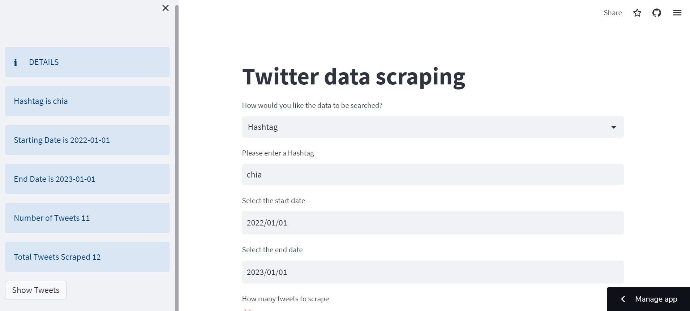
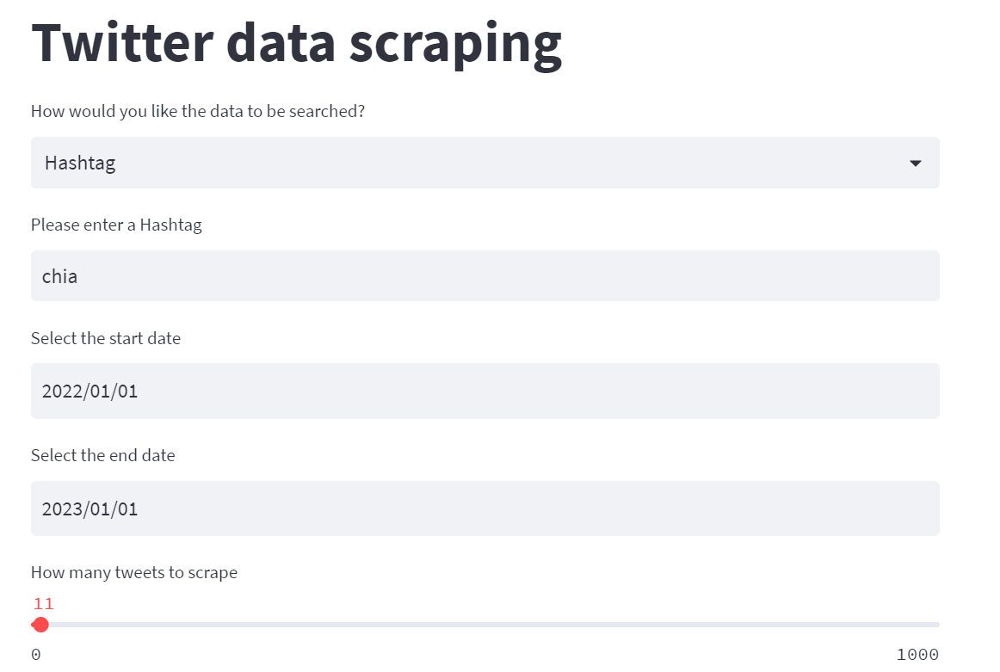
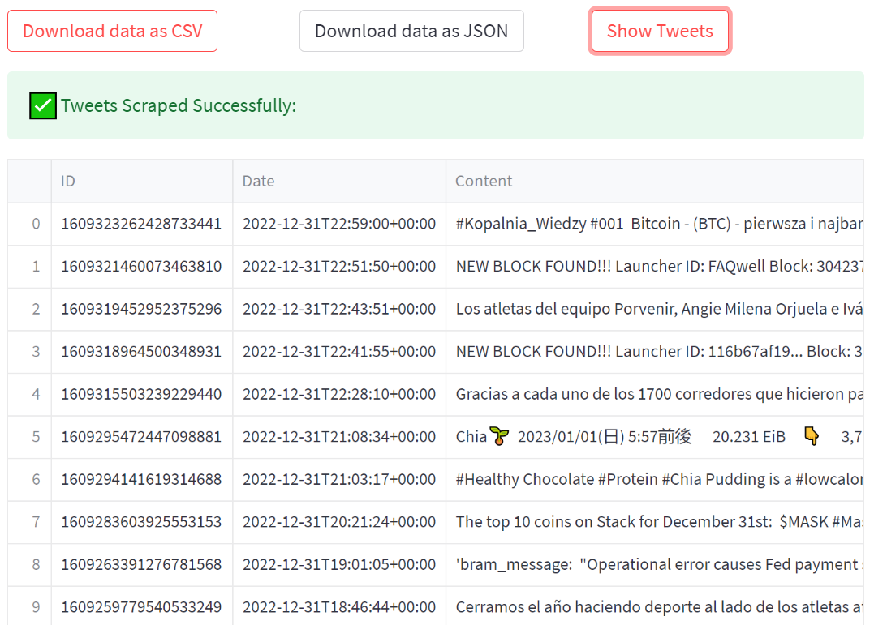

# Twitter-Scrapping         

Application Link : https://shamhiruthik-twitter-scrapping-twitter-scraper-app-m9zje5.streamlit.app/

Demo Video Link  :

## About

## Built using
 * Streamlit
 * Snscrape
 * MongoDb
 * Python Script
 
 
 ## Demo Images
 
 ### 1. Web App
 
 
 ### 2. Request Tweet
 
 
 
 ### 3. Results
 
 
 ## Installation and Running
 
 open cmd:
1. > C:\Users\shamhiruthik> pip install virtualenv 
2. > C:\Users\shamhiruthik> virtualenv my_twitter_env
3. > C:\Users\shamhiruthik> cd my_twitter_env
4. > C:\Users\shamhiruthik\my_twitter_env> cd Scripts
5. > C:\Users\shamhiruthik\my_twitter_env\Scripts>activate                    # It will activate the virtual environment
6. > (my_twitter_env)  C:\Users\shamhiruthik\> mkdir TwitterScraper           #create a folder 
7. > (my_twitter_env)  C:\Users\shamhiruthik\> cd TwitterScraper              # download the above files from this repository and place inside this folder
8. > (my_twitter_env)  C:\Users\shamhiruthik\TwitterScraper> pip install -r requirements.txt       # it will install all the required modules in the environment
9. > (my_twitter_env)  C:\Users\shamhiruthik\TwitterScraper> streamlit run Twitter_Scraper_App.py   # Now run the app using streamlit
10. > You can now view your Streamlit app in your browser.
